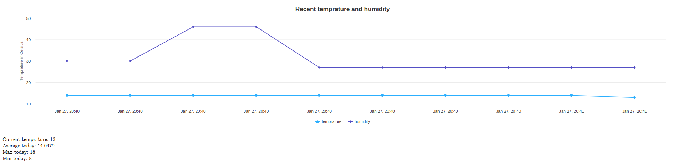

# Weatheria Server
This is a server/frontend for weatheria project. Weatheria is an ecosystem for measuring temprature and creating a neat looking information from it. This server is pretty glueable considering you only need a database inserter. Currently this project is used alongside esp32 but I have plans to use this same server in other projects.
To run this project simply
```sh
./gradlew bootrun
```
and you should be fine (I think). Tested on linux, windows 10/11
# Note
This thing is still highly work in progess since its just been few days I started making this. I have plans to add actually goodlooking frontend. I tried shoelace but didn't like. I also don't wanna go with a js framework. I'd have 3 things running just to host this data which is not what I want.
# Todo
- actual good frontend
- moar graphs
- moar values


How it looks right now. Pretty barebones I'd say.